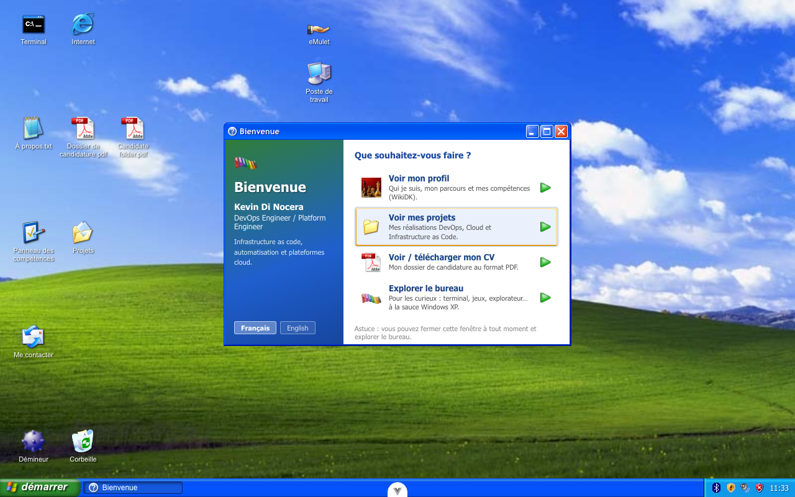
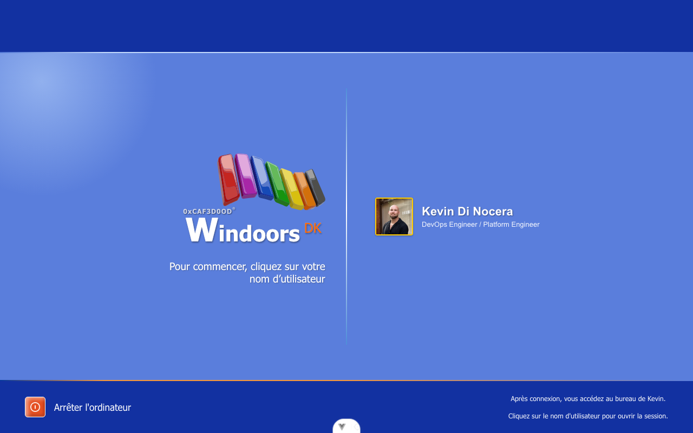
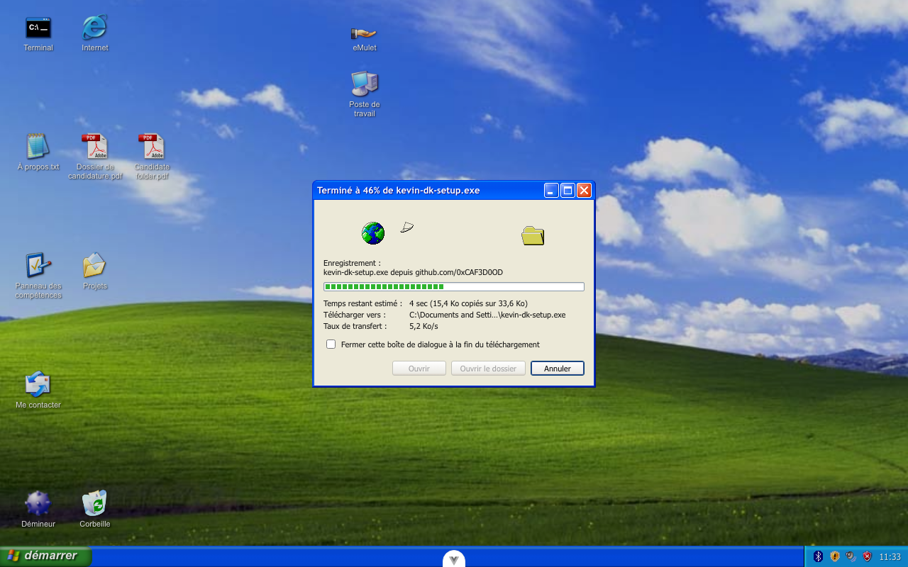
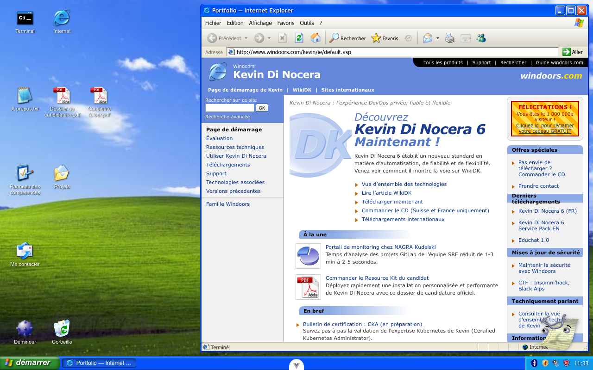
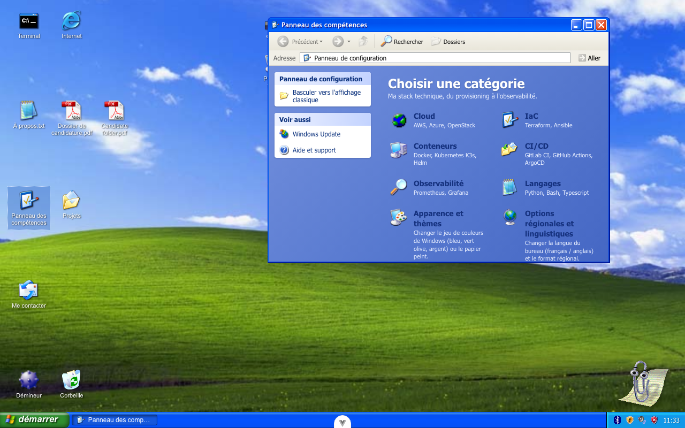
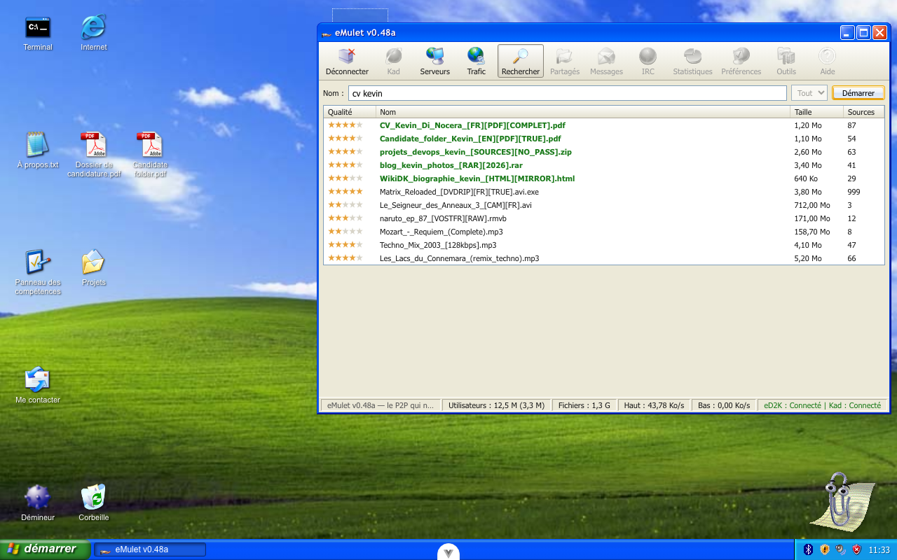

# Windoors XP

<p align="center">
  
</p>

<p align="center"><b><a href="#english">English</a></b> · <b><a href="#français">Français</a></b></p>

---

## English

> **Kevin Di Nocera**'s portfolio (DevOps / Platform Engineer), presented as a complete
> **Windows XP** desktop running in the browser: boot screen, login session, draggable
> windows, Start menu, Control Panel, games, screensaver… and Luna theme switching.

### The idea

Rather than yet another one-page portfolio, I wanted an object that says something about
me: nostalgia, attention to detail, and the urge to understand how things work. The
principle:

- **The portfolio content is disguised as XP applications.** My bio is a "WikiDK"
  article in Internet Explorer, my skills are the Control Panel, my résumé opens in
  Adobe Reader, the contact form is Outlook Express, the blog lives in Windows
  Messenger, and a terminal (`cmd`) answers real commands.
- **Fidelity comes first.** Luna window chrome, system sounds, notification balloons,
  Clippy animated from Microsoft Agent data, blue screen, `desk.cpl` in Run… The goal
  is that anyone who lived through XP feels at home immediately.
- **Everything is homemade except where an open source project does it better** — in
  which case I integrate it and credit it ([CREDITS.md](CREDITS.md) lists everything,
  distinguishing what is reused from what only served as reference).

### What's inside

| XP application | Actual content |
|---|---|
| Internet Explorer → WikiDK | Biography, career, certifications |
| Control Panel | Tech stack by category + related projects |
| Control Panel → Display | **Theme switching** (see below) |
| Adobe Reader | Résumé / application folder (FR + EN) |
| Outlook Express | Contact form (Web3Forms) |
| MSN / Windows Messenger | Chat wired to a Discord webhook + blog with photos |
| MSN → SmarterChild | Local 2003-style chatbot (homemade rules, zero API) that knows my background |
| eMulet | Parody P2P client, eMule style: résumé and projects "downloadable" at 48 KB/s |
| My Computer → CD-ROM (D:) | Autorun of an InstallShield wizard that "installs" the application folder |
| Command Prompt | Interactive terminal (`help`, easter eggs…) |
| Run… | Launches apps by their real name (`cmd`, `winmine`, `desk.cpl`…) |
| Search (Rover 🐕) | Global search: skills, projects, blog, career, apps |
| Regional and Language Options | FR / EN desktop language switch |
| Minesweeper, Solitaire, Hearts, Pinball… | Real playable games |
| Winamp | Webamp + Milkdrop visualizer |

### A tour in pictures

<table>
  <tr>
    <td width="50%">
      <br />
      <sub><b>Login screen</b> — click your user name to open the session.</sub>
    </td>
    <td width="50%">
      <br />
      <sub><b>First launch of Internet Explorer</b> — <code>kevin-dk-setup.exe</code> downloads 2001-style, shell32 animation included.</sub>
    </td>
  </tr>
  <tr>
    <td width="50%">
      <br />
      <sub><b>Start menu</b> — every app in its place, "All Programs" cascade included (the greyed-out entries are period-authentic).</sub>
    </td>
    <td width="50%">
      <br />
      <sub><b>windoors.com</b> — the IE home portal, faithful to microsoft.com/ie of the era (millionth-visitor banner included).</sub>
    </td>
  </tr>
  <tr>
    <td width="50%">
      <br />
      <sub><b>Skills panel</b> — the tech stack presented as the XP Control Panel.</sub>
    </td>
    <td width="50%">
      <br />
      <sub><b>eMulet</b> — résumé and projects at 56k pace; files in green really exist on this desktop.</sub>
    </td>
  </tr>
</table>

### Themes (Display Properties)

The desktop ships the **three Luna color schemes** of XP — **Blue (default)**,
**Olive Green** and **Silver** — plus the wallpaper choice (Bliss, Windoors, none),
through a reproduction of the "Display Properties" dialog (Control Panel → Appearance
and Themes, or `desk.cpl` in Run).

<p align="center">
  
</p>

The implementation follows the approach of
[classic-stylesheets](https://github.com/nielssp/classic-stylesheets) (nielssp, MIT):
a **structural base** (dimensions, gradients, shadows of the XP chrome) separated from
**swappable skins**. Here the skins are CSS variable sets
([`frontend/src/assets/themes.css`](frontend/src/assets/themes.css)) activated by a
`data-xp-theme` attribute on `<html>`; the olive and silver palettes come from the
`winxp` skins of classic-stylesheets. The choice is persisted in `localStorage`, and
the default skin keeps the previous values identical: without user action, nothing
changes.

### Architecture

```
frontend/                  Vue 3 + TypeScript + Vite (100% static SPA)
├─ src/desktop/            the "operating system"
│  ├─ XpDesktop.vue        desktop, taskbar, icons, screensaver, BSOD
│  ├─ XpWindow.vue         generic window (drag, 8-handle resize, min/max)
│  ├─ useWindows.ts        window manager (z-order, state, taskbar)
│  ├─ registry.ts          application catalog (id, icon, size…)
│  ├─ theme.ts             theme + wallpaper (persisted, cf. themes.css)
│  ├─ fileTree.ts          C:\ tree for the generic Explorer
│  └─ apps/                each XP application = one Vue component
├─ src/games/              games (Vue components or iframes from public/games/)
├─ src/assets/themes.css   Luna skins (CSS variables per data-xp-theme)
├─ src/assets/xp-window.css XP window chrome (structure, consumes the variables)
└─ public/                 XP assets (icons, sounds, wallpapers, static games)
```

A few technical choices:

- **No windowing framework**: `useWindows.ts` is a minimal Vue composable that handles
  z-order, minimizing and the taskbar.
- **Apps are decoupled**: they communicate through `provide/inject`
  (`openApp`, `showError`, `triggerBsod`…), so each app remains an isolated component.
- **Heavy games run in iframes** (Pinball, Solitaire…) to isolate their JS; the desktop
  watches activity inside them for the screensaver.
- **No backend**: the site is a static build; contact and chat go through external
  services (Web3Forms, Discord webhook).

### Development

```bash
cd frontend
npm install
npm run dev          # http://localhost:5173
npm run type-check   # vue-tsc
npm run lint         # oxlint + eslint
npm run build        # type-check + build → frontend/dist/
```

### Deployment

`npm run build` produces a fully static `dist/` folder. Two options documented in
[DEPLOY.md](DEPLOY.md):

- **OpenStack object storage (Swift)** in static website mode — no server;
- **Docker + nginx** (the root [Dockerfile](Dockerfile) does the multi-stage build),
  for a self-hosted instance. `INFRA/` contains the Terraform starter.

### Credits & licenses

All sources (reused repositories, references, icon packs, libraries) are detailed in
[CREDITS.md](CREDITS.md). Microsoft assets (icons, sounds, emoticons) are used in a
nostalgic / educational spirit; the integrated libraries (Webamp, Butterchurn,
Three.js, classic-stylesheets…) are MIT-licensed.

---

## Français

> Portfolio de **Kevin Di Nocera** (DevOps / Platform Engineer), présenté comme un
> bureau **Windows XP** complet qui tourne dans le navigateur : écran de démarrage,
> session, fenêtres déplaçables, menu Démarrer, Panneau de configuration, jeux,
> économiseur d'écran… et changement de thème Luna.

### La démarche

Plutôt qu'un énième portfolio one-page, j'ai voulu un objet qui raconte quelque chose
de moi : de la nostalgie, du soin du détail, et l'envie de comprendre comment les
choses marchent. Le principe :

- **Le contenu du portfolio est déguisé en applications XP.** Ma bio est un article
  « WikiDK » dans Internet Explorer, mes compétences sont le Panneau de configuration,
  mon CV s'ouvre dans Adobe Reader, le formulaire de contact est Outlook Express, le
  blog vit dans Windows Messenger, et un terminal (`cmd`) répond à de vraies commandes.
- **La fidélité prime.** Chrome des fenêtres Luna, sons système, bulles de
  notification, Clippy animé à partir des données Microsoft Agent, écran bleu,
  `desk.cpl` dans Exécuter… Le but est que quelqu'un qui a connu XP s'y retrouve
  immédiatement.
- **Tout est fait maison sauf quand un projet open source fait mieux** — dans ce cas
  je l'intègre et je le crédite ([CREDITS.md](CREDITS.md) recense tout, en distinguant
  ce qui est réutilisé de ce qui n'a servi que de référence).

### Ce qu'on y trouve

| Application XP | Contenu réel |
|---|---|
| Internet Explorer → WikiDK | Biographie, parcours, certifications |
| Panneau de configuration | Stack technique par catégories + projets associés |
| Panneau de configuration → Affichage | **Changement de thème** (voir ci-dessous) |
| Adobe Reader | CV / dossier de candidature (FR + EN) |
| Outlook Express | Formulaire de contact (Web3Forms) |
| MSN / Windows Messenger | Chat relié à un webhook Discord + blog avec photos |
| MSN → SmarterChild | Bot de chat local façon 2003 (règles maison, zéro API) qui connaît mon parcours |
| eMulet | Client P2P parodique façon eMule : CV et projets « à télécharger » à 48 Ko/s |
| Poste de travail → CD-ROM (D:) | Autorun d'un assistant InstallShield qui « installe » le dossier de candidature |
| Invite de commandes | Terminal interactif (`help`, easter eggs…) |
| Exécuter… | Lance les apps par leur vrai nom (`cmd`, `winmine`, `desk.cpl`…) |
| Rechercher (Rover 🐕) | Recherche globale : compétences, projets, blog, parcours, apps |
| Options régionales et linguistiques | Bascule de langue FR / EN du bureau |
| Démineur, Solitaire, Hearts, Pinball… | Vrais jeux jouables |
| Winamp | Webamp + visualiseur Milkdrop |

### Le tour en images

<table>
  <tr>
    <td width="50%">
      <br />
      <sub><b>Écran de connexion</b> — cliquez sur votre nom d'utilisateur pour ouvrir la session.</sub>
    </td>
    <td width="50%">
      <br />
      <sub><b>Premier lancement d'Internet Explorer</b> — <code>kevin-dk-setup.exe</code> se télécharge façon 2001, animation shell32 comprise.</sub>
    </td>
  </tr>
  <tr>
    <td width="50%">
      <br />
      <sub><b>Menu Démarrer</b> — chaque app à sa place, cascade « Tous les programmes » comprise (les entrées grisées sont d'époque).</sub>
    </td>
    <td width="50%">
      <br />
      <sub><b>windoors.com</b> — le portail de démarrage d'IE, fidèle au microsoft.com/ie de l'époque (bannière du millionième visiteur comprise).</sub>
    </td>
  </tr>
  <tr>
    <td width="50%">
      <br />
      <sub><b>Panneau des compétences</b> — la stack technique présentée comme le Panneau de configuration XP.</sub>
    </td>
    <td width="50%">
      <br />
      <sub><b>eMulet</b> — CV et projets au rythme du 56k ; les fichiers en vert existent vraiment sur ce bureau.</sub>
    </td>
  </tr>
</table>

### Les thèmes (Propriétés d'affichage)

Le bureau propose les **trois jeux de couleurs Luna** de XP — **Bleu (par défaut)**,
**Vert olive** et **Argent** — plus le choix du papier peint (Bliss, Windoors, aucun),
via une reproduction de la boîte de dialogue « Propriétés d'affichage » (Panneau de
configuration → Apparence et thèmes, ou `desk.cpl` dans Exécuter).

<p align="center">
  
</p>

L'implémentation reprend la démarche de
[classic-stylesheets](https://github.com/nielssp/classic-stylesheets) (nielssp, MIT) :
une **base structurelle** (dimensions, dégradés, ombres du chrome XP) séparée de
**skins interchangeables**. Ici les skins sont des jeux de variables CSS
([`frontend/src/assets/themes.css`](frontend/src/assets/themes.css)) activés par un
attribut `data-xp-theme` sur `<html>` ; les palettes olive et argent proviennent des
skins `winxp` de classic-stylesheets. Le choix est persisté en `localStorage`, et le
skin par défaut reprend à l'identique les anciennes valeurs : sans action de
l'utilisateur, rien ne change.

### Architecture

```
frontend/                  Vue 3 + TypeScript + Vite (SPA 100 % statique)
├─ src/desktop/            le « système d'exploitation »
│  ├─ XpDesktop.vue        bureau, barre des tâches, icônes, économiseur, BSOD
│  ├─ XpWindow.vue         fenêtre générique (drag, resize 8 poignées, min/max)
│  ├─ useWindows.ts        gestionnaire de fenêtres (z-order, état, taskbar)
│  ├─ registry.ts          catalogue des applications (id, icône, taille…)
│  ├─ theme.ts             thème + papier peint (persistés, cf. themes.css)
│  ├─ fileTree.ts          arborescence C:\ pour l'Explorer générique
│  └─ apps/                chaque application XP = un composant Vue
├─ src/games/              jeux (composants Vue ou iframes de public/games/)
├─ src/assets/themes.css   skins Luna (variables CSS par data-xp-theme)
├─ src/assets/xp-window.css chrome de fenêtre XP (structure, consomme les variables)
└─ public/                 assets XP (icônes, sons, papiers peints, jeux statiques)
```

Quelques choix techniques :

- **Pas de framework de fenêtrage** : `useWindows.ts` est un composable Vue minimal
  qui gère z-order, minimisation et la barre des tâches.
- **Les apps sont découplées** : elles communiquent par `provide/inject`
  (`openApp`, `showError`, `triggerBsod`…), donc chaque app reste un composant isolé.
- **Les jeux lourds tournent en iframe** (Pinball, Solitaire…) pour isoler leur JS ;
  le bureau surveille l'activité à l'intérieur pour l'économiseur d'écran.
- **Aucun backend** : le site est un build statique ; contact et chat passent par des
  services externes (Web3Forms, webhook Discord).

### Développement

```bash
cd frontend
npm install
npm run dev          # http://localhost:5173
npm run type-check   # vue-tsc
npm run lint         # oxlint + eslint
npm run build        # type-check + build → frontend/dist/
```

### Déploiement

`npm run build` produit un dossier `dist/` entièrement statique. Deux options
documentées dans [DEPLOY.md](DEPLOY.md) :

- **Stockage objet OpenStack (Swift)** en mode site statique — pas de serveur ;
- **Docker + nginx** (le [Dockerfile](Dockerfile) à la racine fait le build multi-stage),
  pour une instance auto-hébergée. `INFRA/` contient l'amorce Terraform.

### Crédits & licences

Toutes les sources (dépôts réutilisés, références, packs d'icônes, bibliothèques) sont
détaillées dans [CREDITS.md](CREDITS.md). Les assets Microsoft (icônes, sons,
émoticônes) sont utilisés dans un cadre nostalgique / éducatif ; les bibliothèques
intégrées (Webamp, Butterchurn, Three.js, classic-stylesheets…) sont sous MIT.
